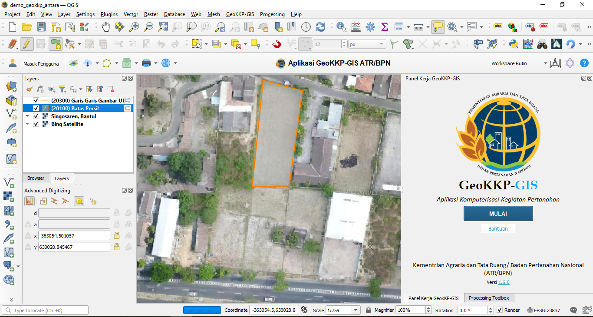

# GeoKKP-GIS


## Tentang Plugin ini
GeoKKP-GIS adalah plugin QGIS yang digunakan dalam kegiatan pemetaan pertanahan yang dilakukan oleh Kementrian Agraria dan Tata Ruang/Badan Pertanahan Nasional (ATR/BPN) untuk keperluan pengolahan data dan pembuatan peta dari hasil akuisisi data di lapangan. Plugin ini menduplikasi fitur-fitur pemetaan yang dimiliki oleh GeoKKP yang sebelumnya digunakan pada perangkat CAD.



GeoKKP-GIS menggunakan prinsip yang berbeda dengan CAD, dengan konsep layer pada aplikasi ini menggunakan prinsip-prinsip GIS. Untuk itu, antarmuka GeoKKP-GIS disesuaikan dengan kebutuhan pengguna dalam melakukan editing data pada perangkat QGIS. Meskipun demikian, plugin ini juga memiliki mode CAD untuk menyesuaikan pengguna yang ingin beralih dari editing dengan AutoCAD.


## Daftar Fungsi
Fungsi-fungsi GeoKKP-GIS saat ini antara lain:
* Integrasi dengan SSO GeoKKP
* Memanggil data persil dari server GeoKKP
* Fungsi Editing dengan tiga mode penggambaran: Manual (GIS), Sudut-jarak dan Mode CAD
* Auto-adjust dan koreksi topologi otomatis
* Layout peta otomatis
* Unggah persil ke server GeoKKP (*incoming feature*)


## Kontribusi
Untuk berkontribusi pada plugin ini, silahkan melakukan komunikasi dengan Pusdatin ATRBPN di support.pusdatin@atrbpn.go.id


## Prosedur untuk Release
Berikut adalah tahapan untuk melakukan release versi baru.
1. _Merge branch_ develop ke _master_
2. Pastikan versi di metadata.txt sudah diperbaharusi, misalnya `version=1.0.1`
3. _Checkout master branch_. Contoh: `git checkout origin/master`
4. Buat _tag_ pada _master branch_ tersebut dengan versi sebagai tag-nya. Misal untuk versi 1.0.1 menggunakan tag `version-1_0_1`. Contoh: `git tag version-1_0_1`
5. Push _tag_ tersebut ke Github. Contoh: `git push version-1_0_1`
6. Buat release baru di Github: [Release Baru](https://github.com/danylaksono/GeoKKP-GIS/releases/new), dengan menggunakan tag tersebut.
7. Berikan keterangan pada release versi tersebut (Changelog)
8. Tekan tombol _Publish release_
9. Github akan membuat berkas terkompresi dari plugin ini
10. Upload berkas terkompresi tersebut ke [Plugin QGIS](https://plugins.qgis.org/) agar pengguna bisa mengunduhnya.

## Lisensi
Lisensi aplikasi GeoKKP-GIS berada di bawah naungan **GNU-AGPLv3** sebagai berikut:

```
GNU AGPLv3

Permissions of this strongest copyleft license are conditioned on making available complete source code of licensed works and modifications, which include larger works using a licensed work, under the same license. Copyright and license notices must be preserved. Contributors provide an express grant of patent rights. When a modified version is used to provide a service over a network, the complete source code of the modified version must be made available.
```
